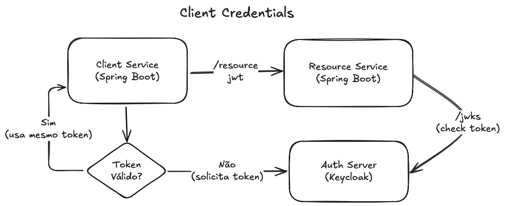

<h1 align="center">
  Client Credentials
</h1>

<p align="center">
 
 
</p>

Esse projeto apresentado [nesse vídeo](https://youtu.be/BoPLhhIN9ks) demonstra como implementar o grant type Client Credentials do Oauth 2.0 com o Spring Security.

## Tecnologias

- [Spring Boot](https://spring.io/projects/spring-boot)
- [Spring Security](https://spring.io/projects/spring-security)
- [Spring Oauth Client](https://docs.spring.io/spring-security/reference/servlet/oauth2/client/index.html)
- [Spring Oauth Resource Server](https://docs.spring.io/spring-security/reference/servlet/oauth2/resource-server/index.html)
- [Spring Webflux](https://docs.spring.io/spring-framework/reference/web/webflux.html)

## Funcionalidades

- [x] Integração com Keycloak
- [x] Geração de JWT
- [x] Autenticação

## Arquitetura



## Como executar

### Keycloak

- Executar com Docker:
```
docker run -p 8080:8080 -e KEYCLOAK_ADMIN=admin -e KEYCLOAK_ADMIN_PASSWORD=admin quay.io/keycloak/keycloak:22.0.5 start-dev
```

- Gerar clientId e clientSecret
  
- Configurar Token
  - Access token lifespan: 2 min

Toda a configuração do Keycloak é mostrada passo-a-passo [nesse vídeo](https://youtu.be/BoPLhhIN9ks).
  
### Aplicação

- Clonar repositório git:
```
git clone https://github.com/giuliana-bezerra/client-credentials.git
```
- Construir o projeto (com restclient):
```
cd client-service-restclient
./mvnw clean package

cd ../resource-service
./mvnw clean package
```
- Executar:
```
java -jar ./target/client-service-restclient-0.0.1-SNAPSHOT.jar
```

Utilizar o arquivo `sample.http` para realizar uma requisição autorizada com client credentials.
